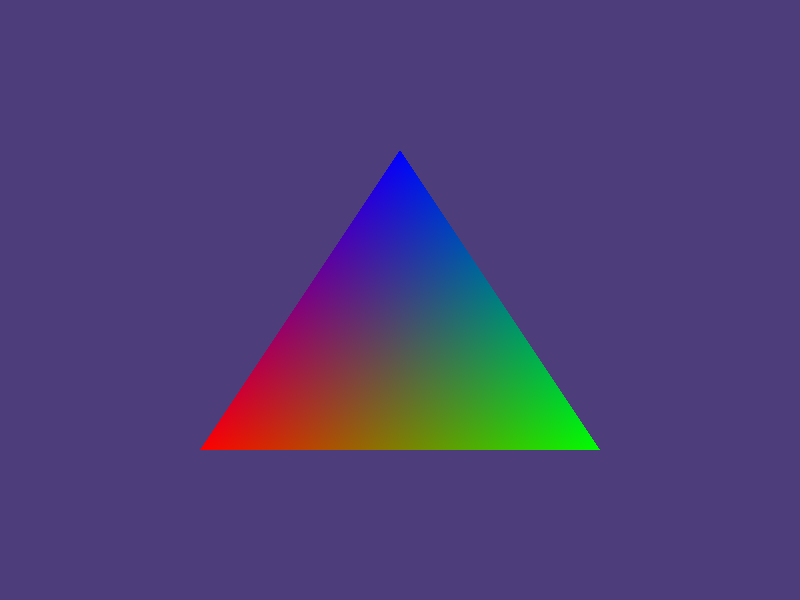

# "Hello World" Triangle with Wayland

This application demonstrates on how to draw colorful triangle
on Wayland. It uses OpenGL as the rendering machine.

# Requirements
```
wayland-client >= 1.22.0
egl >= 1.7.0
wayland-egl >= 1.22.0
opengl >= 3.x

meson >= 1.3.0
```

# How to build
Run this command below
```
meson setup <build_directory>
meson compile -C <build_directory>
```

`<build_directory>` specifies the location to put the executable

# How to run
Suppose the `<build_directory>` is located on `./build` then to run the program:
```
./build/triangle-wayland-opengl
```

To output debug of Wayland, add environment variable `WAYLAND_DEBUG=1`:
```
WAYLAND_DEBUG=1 ./build/triangle-wayland-opengl
```

# Changing background color
You can change the background color at line 146. Within the values ranging from `0.0F` to `1.0F`,
set the first, second, third parameter as you please to change the red, green, blue intensity 
respectively.

Example: Set background color to black
```
glClearColor(0.0F, 0.0F, 0.0F, 1.0F)
```

# Triangle Demo

